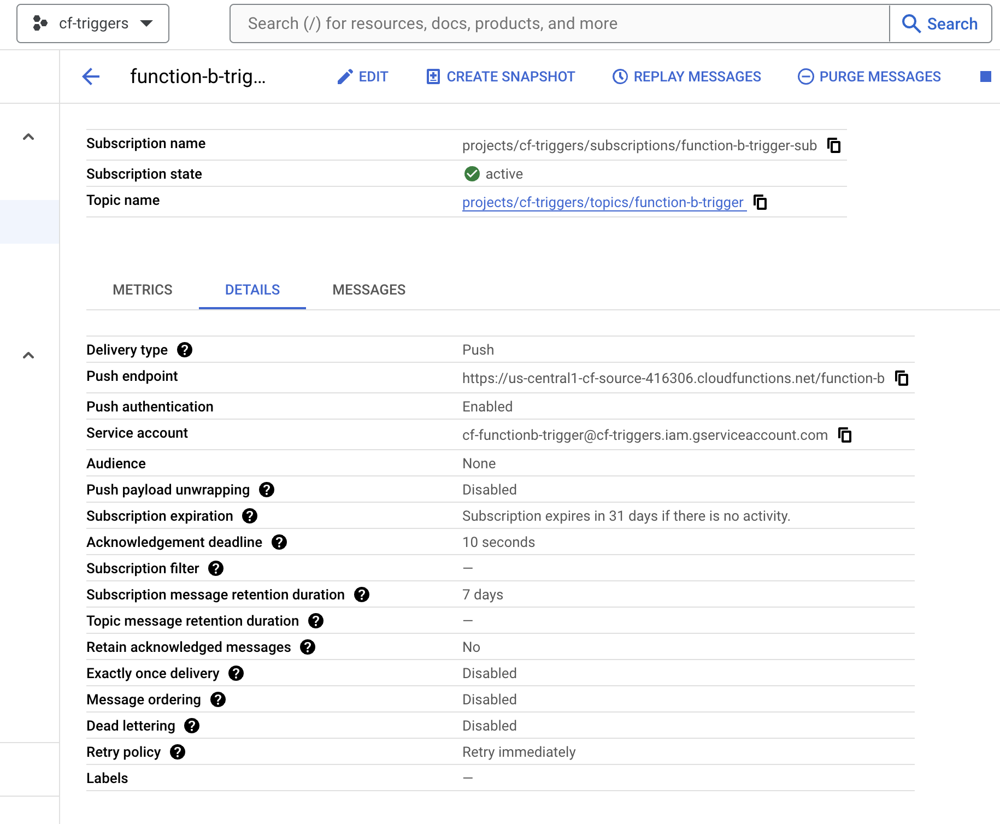

Configuration:



Policy binding configuration in cloudfunction source project:

```
❯ gcloud functions add-iam-policy-binding  function-b --region=us-central1 --member=serviceAccount:cf-functionb-trigger@cf-triggers.iam.gserviceaccount.com --role=roles/cloudfunctions.invoker
```

1. sending a message to topic


❯ gcloud config set project cf-triggers
Updated property [core/project].


❯ gcloud pubsub topics publish function-b-trigger  --message "Sending Data from cf-trigger which is a project to another project called cf-source where the cloudfunction is hosted"
messageIds:
- '9417619268166724'

2. lets switch to project where the cloudfunction is hosted


❯ gcloud functions logs read function-b --gen2 --region us-central1 --start-time="2024-03-13 11:09:05.634 PDT"

```
LEVEL  NAME        TIME_UTC                 LOG
       function-b  2024-03-13 18:09:06.713  end.
       function-b  2024-03-13 18:09:06.713  {'message': {'data': 'U2VuZGluZyBEYXRhIGZyb20gY2YtdHJpZ2dlciB3aGljaCBpcyBhIHByb2plY3QgdG8gYW5vdGhlciBwcm9qZWN0IGNhbGxlZCBjZi1zb3VyY2Ugd2hlcmUgdGhlIGNsb3VkZnVuY3Rpb24gaXMgaG9zdGVk', 'messageId': '9417619268166724', 'message_id': '9417619268166724', 'publishTime': '2024-03-13T18:09:04.531Z', 'publish_time': '2024-03-13T18:09:04.531Z'}, 'subscription': 'projects/cf-triggers/subscriptions/function-b-trigger-sub'}
       function-b  2024-03-13 18:09:06.713  Start..
I      function-b  2024-03-13 18:09:06.655  Default STARTUP TCP probe succeeded after 1 attempt for container "worker" on port 8080.
I      function-b  2024-03-13 18:09:05.634
       function-b  2024-03-13 16:32:22.581  end.
       function-b  2024-03-13 16:32:22.581  {'name': 'Hello World'}
       function-b  2024-03-13 16:32:22.581  Start..
I      function-b  2024-03-13 16:32:22.499  Default STARTUP TCP probe succeeded after 1 attempt for container "worker" on port 8080.
I      function-b  2024-03-13 16:32:21.597
```

Lets encode the data to check, 


```
❯ echo "U2VuZGluZyBEYXRhIGZyb20gY2YtdHJpZ2dlciB3aGljaCBpcyBhIHByb2plY3QgdG8gYW5vdGhlciBwcm9qZWN0IGNhbGxlZCBjZi1zb3VyY2Ugd2hlcmUgdGhlIGNsb3VkZnVuY3Rpb24gaXMgaG9zdGVk" | base64 -d
Sending Data from cf-trigger which is a project to another project called cf-source where the cloudfunction is hosted%  
```
