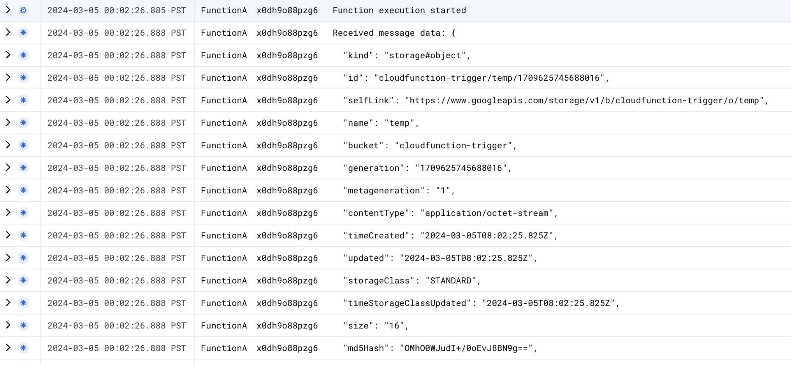

Here we are going to create a function in project cf-source and a trigger project in cf-trigger

Permissions for trigger:

Pubsub:
Service account(s) might not have enough permissions to deploy the function with selected trigger. To mitigate potential errors, you can grant them the following roles:
roles/iam.serviceAccountTokenCreator to service-1031278184125@gcp-sa-pubsub.iam.gserviceaccount.com

DEMO STARTS HERE, But its for Gen 1 only. Gen2 work is inprogress.

cmd:

gcloud functions deploy my_pubsub_function --region=us-east1 --runtime="python311" --trigger-topic projects/cf-triggers/topics/send-to-project-cf-source --entry-point=hello_pubsub --source="gs://cf-source-416306/pubsub_trigger/function-source.zip"

Project A: cf-source -> project used to host cloud function
Project B: cf-trigger -> project hosts triggers

Project A ( cf-source : https://us-central1-cf-source-416306.cloudfunctions.net/FunctionA)
Add Project B svc account to Project A

switch to Project B (cf-triggers)

create a topic ( projects/cf-triggers/topics/send-to-project-cf-source)

gsutil notification create -t projects/cf-triggers/topics/send-to-project-cf-source -f json gs://cloudfunction-trigger/
>Created notification config projects/_/buckets/cloudfunction-trigger/notificationConfigs/1

create a subcription (projects/cf-triggers/subscriptions/trigger-subscription)
set the push target at https://us-central1-cf-source-416306.cloudfunctions.net/FunctionA
enable authentication and set it a service account that you added to project A (cf-triggers)

Sending a file to project B (cf-triggers bucket)
❯ gsutil cp ./temp  gs://cloudfunction-trigger/
Copying file://./temp [Content-Type=application/octet-stream]...
/ [1 files][   16.0 B/   16.0 B]                                                
Operation completed over 1 objects/16.0 B.  

Check logs in project A (cf-trigger):

